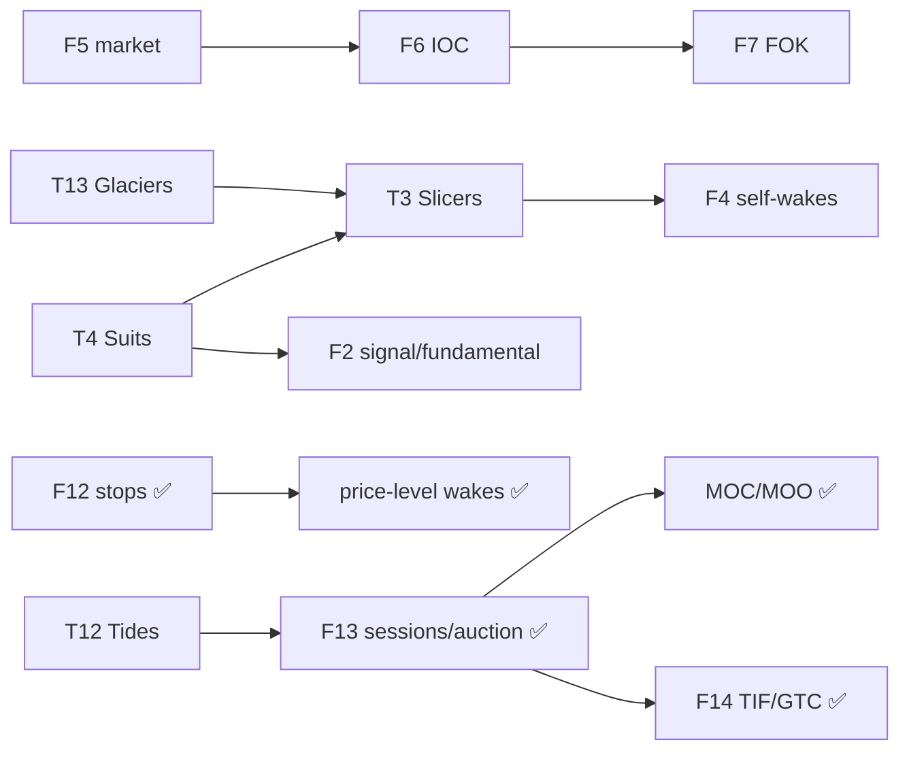

# TILTYARD — Engine Feature Backlog

The engine features the agent tiers (`TILTYARD_AGENTS.md`) need but that don't
exist yet, sorted by implementation difficulty **inside this codebase** — not
generic difficulty. Each entry explains *what the thing actually is* (some are
trading-desk jargon), *how it would be built here*, what it depends on, and
which of the fourteen tiers (T1–T14) it unlocks.

Two ideas do most of the work in this doc:

1. **Difficulty ≠ build order.** Several features share one underlying
   mechanism, so building one nearly gives you the next for free. Those
   groupings are called out and drive the recommended order at the bottom.
2. **Unlock vs. enable.** `UNLOCK` = the tier literally cannot exist without it.
   `enable` = the tier already works in a crippled form, and this makes it
   correct or higher-fidelity.

---

## 0. What exists today (baseline)

So the "what's missing" below has a reference point. The engine currently is:

- A **continuous order book** (`ob.c`), matched one at a time, price-time priority.
  Limit *and* market (`IS_MARKET_BIT`), with match-time TIF (`IOC_BIT`, `FOK_BIT`;
  GTC is the default, i.e. neither bit set) *and* lifetime TIF (`DAY_BIT`, `GTD_BIT` —
  swept at the session close, GTD's expiry date rides in `second_id`).
- **Cancel** (`CANCEL_BIT`), **cancel-replace** (`CAN_REP_BIT`, `ob_canrep`).
- **Atomic bid+ask pair / mass quote** (`ASK_BID_PAIR_BIT`, `ob_pair`) — the maker's
  two-sided quote, posted, replaced, **or pulled** in one atomic book pass. A pair
  carrying `CANCEL_BIT` cancels both resting legs at once, which is the pull a market
  maker actually wants; it needs no quantity or prices of its own. Market and TIF bits
  are rejected on a pair — both legs are resting quotes or cancels, so neither means
  anything there.
- **Cash-account settlement** (`server.c`): buying power = `cash - reserved_cash`;
  a sell needs `shares - reserved_shares` to cover it.
- **Margin-account settlement** (`server.c`, `client_bp`), picked per client by
  `is_cash_account`. Inventory is signed (`i64 cash`, `i64 shares`; negative = margin
  loan / short), so shorting is just selling past zero. Reg T buying power is
  `m*cash + (m-1)*LMV - (m+1)*SMV`, less what resting orders committed — the expanded
  form of `m * (equity - (LMV+SMV)/m)`, so it never divides. `margin_mult` is the
  *initial* multiplier (2 = Reg T 50%, 4 = PDT intraday); `maint_pct` is the separate
  *maintenance* threshold, per client. Marked against `sc->mark` (last trade).
- **Fills / partial fills** (`FILL_BIT`, `PARTIAL_FILL_BIT`) and a **reject**
  (`REJECT_BIT`) that says why via `rej_reason` (codes in `response.h`).
- **Iceberg orders** (`ICEBERG_BIT`, `iceberg.h`, `server.c`): a resting order shows a
  `quantity` tip while the `second_quantity` total hides in an `Iceberg` freelist; each
  emptied tip re-queues the next slice through the convert path. Marketable ones fill on
  arrival then rest a tip. Cancelling a tip kills the whole order.
- **Market sessions** (`sc->is_open`, `server_market_open/close`): 9:30–4 eastern, no DST,
  so 14:30–21:00 UTC — t=0 is midnight UTC 1/1/1970, a Thursday. Open and close reschedule
  each other (`CONTROL_PARAM_OPEN/CLOSE`); a Friday close jumps the weekend. While closed,
  anything off the sw queue rejects with `REJ_MARKET_CLOSED`. At each close the DAY orders
  (a cb of ids) and the due GTD orders (date-keyed heap, popped while `date <= today`) are
  pulled in **one** new book snapshot (`ob_expire`): expiring ids re-key into a price-sorted
  heap, drain into a flat buffer, and a two-pass walk prunes every level at once. Reserves
  come back (iceberg hidden halves included) and clients hear `CXL_SESSION_CLOSE`. Stale
  ids from fills/recycling are tombstone-guarded (live + TIF bit + GTD date match).
- **Response delay** already models processing + wire latency
  (`processing_time` + `net_latency` jitter) — this is `TILTYARD_AGENTS.md` §1.2,
  already done.
- **Scheduling**: a client is booted once at `initial_wake`, woken by responses to
  *its own* orders (+ ws trade broadcasts, + ping), and can now **re-arm itself** by
  setting `ctx->wake_delay_ns` and returning bit 2 of the action.
- **The clock** (`ctx->real_time_ns`) and an **engine-pushed news signal**
  (`ctx->news_signal`, `ctx->last_news_ns`) are on the `Context`.
- **Queue position** (`ob_queue_position`): the MBO carries real per-order entries,
  so a client can count the quantity ahead of its own order at a level.
- **MBP** (`mbp.h`): an aggregated price-level mirror of the MBO, rebuilt on every
  book change. Not delivered to clients yet — `Response` only carries the MBO id.
- New client types are added with one line in the `IMPLS` X-macro; instance
  counts come from `client_allocations[type_index]`.

Every order bit is now **read**: `HAS_STOP_BIT` + `Order.stop_price` + `OCO_BIT` landed
with F12/F8 (a stop's params ride the `second_*` fields, and `Order.ns` — an arrival
stamp — was added to break the recycled-id tie at trigger time). `is_cash_account` and
`ICEBERG_BIT` read as of F10; `buying_power` is gone — buying power is derived from the
position, not stored, so it can't go stale. `status` widened to `u32` to fit `ICEBERG_BIT`
at bit 16, and `DAY_BIT`/`GTD_BIT` sit above it at 17/18.

---

## 1. Feature catalog (easiest → hardest)

### Band 1 — Trivial (localized, additive, no new matching path)

---

#### F1 · Reject reasons ✅ DONE
**Difficulty:** trivial · **Depends on:** nothing · **Unlocks:** — · **Enables:** T1 Flickerers, T2 Snipers (react correctly to *why* they were rejected)

**Shipped as** a `rej_reason` byte on `Response`/`Context`, with the codes listed
in `response.h`. The prechecks (`add_precheck`, `cancel_precheck`, `pair_precheck`)
each return *why* they failed rather than a bare 0/1, and `server_order` passes the
first reason that came up straight out to the client instead of AND-ing the detail
away. A client reads `ctx->rej_reason` alongside `REJECT_BIT`. Codes get added as
the engine grows checks, so an unknown value just means a code newer than the
client — treat it as `REJ_OTHER` rather than asserting.

Covered today: bad quantity, bad price, contradictory bits, crossed pair, no buying
power, no shares, and the three ways a cancel/replace target can be unusable
(unknown, not yours, already done). The market-state reasons a real venue also sends
— closed, halted, price band, self-match — land with the features that check for
them (F4, F13).

**What it caught.** Splitting the bit apart immediately showed ~99.99% of all rejects
were `REJ_INVALID_QUANTITY` on zero-quantity orders, from two unrelated places. First,
a ping / ws toggle is *deliberately* quantity-0 — it's a control message, not an
order, and `add_precheck` was bouncing it on its first line. That's fixed: those now
skip the prechecks and ack with `CONTROL_BIT` + `REASON_NONE`, and `main.c` frees the
slot on that bit instead of on a reject it never earned. Second, and still open,
`client_one` falls through to `return 1` with a zeroed order once both `bid_order_id`
and `ask_order_id` are set — the reject wakes it, it sends another empty order, and it
spins. That one is a client bug, not an engine bug, but it was invisible while every
reject looked alike.

**Known wrong.** An IOC that finds nothing and a killed FOK come back on
`REJECT_BIT` carrying `CXL_IOC_UNFILLED` / `CXL_FOK_KILLED`. No real venue rejects
those: the order was accepted, it just never traded, so they're reported as
*cancels*. The reason code is now honest; the bit still isn't. Closing that needs a
`CANCELLED_BIT` plus a matching change to the free-on-reject branch in `main.c` — see
F6, which has the same complaint. `status` is a full `u16` now (14 = `STOP_LIMIT_BIT`,
15 = `CONTROL_BIT`), so that bit has to be found first.

---

#### F2 · Exposed `sim_time` + client-side fundamental value ✅ DONE
**Difficulty:** trivial (engine side) · **Depends on:** nothing · **Unlocks:** T4 Suits, T9 Oracles · **Enables:** T2 Snipers (fair value), T5 Degens (signal)

**Shipped as** `ctx->real_time_ns`, set from `sch_now_ns` on every wake. The
fundamental-value process on top of it is still client-side and unwritten, but the
engine gap is closed — and F9 landed too, so the shared signal is engine-owned.

**What "fundamental value" / "signal" is.** In a real market there's a notion of
what a stock is "actually worth" — its fundamental value — which drifts over time
and jumps on news. *Informed* traders (hedge funds, value investors) estimate it
and trade toward it: buy when price is below fair value, sell when above. That
informed flow is what makes prices move in a realistic way (fat tails, volatility
clustering). A "signal" is a subscribable stream of that information (a news event,
a fair-value update).

**In tiltyard.** You flagged this as "arguably client-side," and it is. The only
engine gap is that clients can't see the clock: `main.c` has `now_ns` but never
puts it on the `Context`. Add `ctx->sim_time_ns` (one line). Then the
fundamental-value process is a **shared client-side header** — a pure
deterministic function of `(sim_time, seed)` that any informed client calls. No
engine matching change. Because the whole sim is deterministic off one seed,
several clients reading the same process are automatically *correlated* (needed
for herd behavior) without any engine support. A richer *engine-pushed* news
stream is a separate item (F9) you probably won't need.

---

### Band 2 — Easy / Low-Medium (one contained tweak or one new plumbing channel)

---

#### F3 · Queue-position on the ack ✅ DONE (the proper path)
**Difficulty:** low (cheap path) / medium (proper path) · **Depends on:** nothing · **Unlocks:** — · **Enables:** T1 Flickerers ("requote on queue slip")

**Shipped as** `ob_queue_position(price, order_id, mbo_raw)`. The MBO turned out to
already be a *real* MBO — `MBOLevel.entries[]` carry `order_id`, written by
`mbo_app_level` — so the "proper" path was the cheap one after all. The client
passes the price in as a shortcut (it can't scan `FL* orders`, which is live and
therefore cheating), walks its level, and sums the quantity ahead of itself.
Returns `MAX_U32` when the order isn't in the book. The aggregated-level view that
this section warned about now lives separately as the MBP.

**What it is.** At a single price level, orders fill first-in-first-out. Your
**queue position** is how much quantity sits *ahead* of you at your price. It
matters enormously to a market maker: near the front of the queue you fill first;
if a wave of size joins ahead of you, or the ones ahead cancel, your effective
position shifts and you may want to re-post to regain priority ("queue slip").

**In tiltyard.** Careful: despite the name, the snapshot today is market-by-**price**
(`MBOIndex{price, quantity}` = aggregated level totals), *not* market-by-order.
You can see the total at your level but not how much is ahead of *you*
specifically. Two costs:
- **Cheap:** at ack time, walk the level's resting entries up to this order, sum
  the quantity ahead, attach it to the `Response`. Same "attach info to the ack"
  pattern as F1.
- **Proper:** actually populate the per-order entries (`MBOEntry.order_id`, "not
  filled out for now") so the snapshot is a *real* MBO — then every client derives
  its own queue position, exactly the "get it from the MBO" idea. More broadly
  useful, but changes the snapshot format + serialization in `ob.c`.

---

#### F4 · Client-scheduled wakes (time-based) ⭐ ✅ DONE
**Difficulty:** low-medium · **Depends on:** nothing · **Unlocks:** T3 Slicers, T7 Tappers, T10 Metronomes, T13 Glaciers · **Enables:** T4 Suits, T5 Degens, T8 Setters, T9 Oracles, T12 Tides

**Shipped** exactly as described: `on_snapshot` returns a bitmask now, bit 1 = "I'm
sending an order" (what it always meant), bit 2 = "wake me again in
`ctx->wake_delay_ns`", which `main.c` turns into a `CONTROL(client_id)` event. The
two are independent, so a client can re-arm without trading — which is what the
low-frequency tiers do most of the time.

**Highest leverage on the list for its effort** — it's the single change that
unblocks the most tiers.

**What it is.** Most participants aren't reacting tick-by-tick. A DCA investor
buys every payday (calendar). An execution algo posts a child order every few
seconds (interval). A retail app user wakes at random low-frequency intervals
(Poisson). All of these need to say "wake me again later," which the engine can't
express today — a client only re-wakes when something happens to an order it
already placed.

**In tiltyard.** The boot path *already does this once*: `CONTROL(client_id)` at
`initial_wake` → PING → `CLIENT_IN`. Re-arming is the same call at a
client-chosen delay. Add one field to `Context` (`wake_again_ns`); in `main.c`
after `on_snapshot`, if it's set, `sch_schedule` a `CONTROL(client_id)` event at
that delay. The scheduler already routes far-future delays into the slow bucket,
which is exactly the "millions of sleeping clients" path the design doc wants to
exercise. Extra wakes are harmless (client just returns 0). Price-*level* wakes
are excluded here — they need a price trigger and fold into stops (F12).

---

#### F5 · Market orders ✅ DONE
**Difficulty:** low-medium · **Depends on:** nothing (pairs with F6) · **Unlocks:** T7 Tappers, T10 Metronomes · **Enables:** T2 Snipers, T5 Degens

**Shipped as** `IS_MARKET_BIT`. Rather than sweeping at an extreme price, the
matcher just skips the price-comparison break entirely when the bit is set, which
is the same thing without the sentinel. The residual is dropped (see F6). A market
order with no liquidity on the other side evaporates: empty affected range + the
`EXACT` op, so it touches nothing and writes no level.

**On the market-buy buying-power wrinkle:** `add_precheck` walks the same levels
the matcher is about to walk, on the same snapshot, accumulating the real cost —
so a market buy is priced exactly, no `price × quantity` estimate needed. It then
**rejects** rather than "fill what the cash covers, drop the rest", which keeps it
consistent with every other precheck in the engine (all-or-reject). Because
market orders can't rest, a market order **must** carry IOC or FOK — `is_market &&
is_gtc` is rejected.

**What it is.** A **market order** has no price — it executes against whatever is
available until filled, and **never rests** in the book. Contrast the
**marketable limit** the engine already supports: a limit priced *through* the
book (e.g. buy limit ≥ best ask) that executes immediately *but with a price cap*,
resting any unfilled remainder at its limit. A true market order has no cap and
drops any unfilled remainder. Retail flow is mostly market orders.

**In tiltyard.** Branch on the already-defined `IS_LIMIT_BIT` in the matching
path. For a market order, sweep at an extreme price (`MAX_U16` for a buy, `0` for
a sell) so it takes every level, and **drop the residual** instead of emitting
`REST_REMAINDER`. One real wrinkle: a market *buy* can't be prechecked on
`price × quantity` (there's no price), so buying power has to be enforced *during*
the sweep — fill what the cash covers, drop the rest. That "drop the residual"
mechanism is shared with IOC (F6).

---

#### F6 · IOC (Immediate-Or-Cancel) ✅ DONE
**Difficulty:** low-medium · **Depends on:** F5 (shares "drop residual") · **Unlocks:** — · **Enables:** T2 Snipers, T5 Degens, T7 Tappers

**Shipped as** `IOC_BIT`. "Drop the residual" fell out of the level bookkeeping for
free: the `EXACT` op means "this op leaves no new level behind", which is precisely
what dropping a residual looks like to the book. So IOC is `REST_REMAINDER` →
`EXACT` at the two points where the sweep stops. The server side matters as much as
the book side — it zeroes the residual so the order can't reserve cash/shares for
quantity that isn't resting anywhere, and reports the fill from a captured
`filled`, not from the (now zeroed) quantity.

**Client-visible semantics:** a partially-filled IOC comes back `FILL_BIT` *without*
`PARTIAL_FILL_BIT` — "partial" means "some is still resting", and for an IOC nothing
ever is. An IOC that fills **nothing** comes back as a **reject**, which is the same
answer a FOK gets when it fails its precheck. That's a slight stretch of
`REJECT_BIT` (the order was accepted, it just found no liquidity) — but it's what
lets the client take the order back and lets `main.c` free it instead of leaking the
slot. F1 narrowed the damage rather than fixing it: the response now carries
`CXL_IOC_UNFILLED` / `CXL_FOK_KILLED`, so a client can at least tell this apart from
a real reject. Straightening the bit out needs a `CANCELLED_BIT` and a matching change
to the free-on-reject branch in `main.c` — the same shape as the ping/ws fix, which
took the last free `status` bit, so this one needs `status` widened first.

**What it is.** **Immediate-Or-Cancel**: fill as much as you can *right now*
against resting liquidity, and cancel (don't rest) whatever's left. A latency
arb / sniper uses this to grab a stale quote's displayed size and *not* leave a
resting order hanging around to be picked off in return.

**In tiltyard.** It's exactly the "drop the residual instead of `REST_REMAINDER`"
behaviour from F5, minus the extreme-price sweep. Build it right after market
orders — same plumbing. Needs a time-in-force bit on the order (there's room).

---

#### F7 · FOK (Fill-Or-Kill) ✅ DONE
**Difficulty:** medium (low) · **Depends on:** F6 · **Unlocks:** — · **Enables:** T2 Snipers (arb legs that must fill complete)

**Shipped as** `FOK_BIT`. The predicted scan-then-commit turned out to be free:
`add_precheck` already walks the marketable levels to price the order, so "did that
walk leave anything unfilled" is the FOK test — `q_remain && is_fok` → reject,
before the book is touched at all.

**What it is.** **Fill-Or-Kill**: fill the *entire* quantity immediately or cancel
the *whole* order — no partial fills allowed. Used when a trade only makes sense
as a complete unit, e.g. one leg of an arbitrage that's worthless half-done.

**In tiltyard.** IOC + a pre-scan: walk the sorted book summing available
marketable quantity up to the limit price, and only commit the cross if it covers
the full size; otherwise reject the order untouched. The scan-then-commit is the
only thing beyond IOC.

> **TIF vs. IOC/FOK — a split worth seeing.** People lump "IOC/FOK/TIF/GTC"
> together, but they live in different difficulty bands. IOC/FOK are decided
> *at match time* and land here (easy-med). **TIF/GTC** (F14) are about an order's
> *lifetime* — surviving or expiring at session boundaries — and can't be built
> until sessions exist (F13, Band 4).
>
> This split is now load-bearing in the code: the "GTC" that F5–F7 shipped is the
> **match-time** sense only — no TIF bit set, so rest the remainder, which is what a
> plain limit always did. F14's lifetime sense has since landed too — and it exposed
> that the F13 dependency was really on session *boundaries*, not the auction: once a
> close exists, DAY/GTD are a sweep, and the auction can come later.

---

### Band 3 — Medium (new machinery, contained; some hooks already exist)

---

#### F8 · OCO (One-Cancels-Other) ✅
**Difficulty:** medium (low) · **Depends on:** nothing (brackets want F12) · **Unlocks:** — · **Enables:** T5 Degens, T8 Setters (bracket orders)

**What it is.** **One-Cancels-Other**: two linked orders where executing one
automatically cancels the other. The classic use is a *bracket* around a position:
a take-profit limit above and a stop-loss below — whichever fills first, the other
is pulled so you don't accidentally trade twice.

**In tiltyard.** Landed on top of F12. No link table — the two orders just carry
`OCO_BIT` and point `other_id` at each other. A combined bracket (a NOW half plus a
stop half, one message) wires the link inline at mint time; both halves are stamped
the same `Order.ns`. `oco_pull(done_id)` mints a synthetic `CANCEL|CONTROL` order for
`other_id` into `convert_holder`, riding the same drain path as stops and iceberg
slices (`CONTROL_BIT` hands the slot back, no leak). Three trigger points: a stop leg
firing pulls its resting sibling right at the trigger (`oco_sweep`), a resting order
filled as **maker** pulls its leg, and a NOW half filled as **taker** on arrival pulls
its leg. Recycled-id safety is the same `ns` idea as the TIF sweeps: a real partner
was placed at-or-before the order pointing at it, so `partner.ns > done.ns` means the
slot was recycled and the pull is skipped (plus the live/`REJECT_BIT` check). Tested
both directions in `tests/test_stops.h`.

---

#### F9 · Signal / news stream (engine-pushed) ✅ DONE
**Difficulty:** medium · **Depends on:** nothing · **Unlocks:** — · **Enables:** T4 Suits, T9 Oracles, T5 Degens

**Shipped**, and built *early* rather than "only if you want the engine to own the
news process" — which it now does. `ctx->news_signal` is an abstract 0–255 scale of
how well $TYD is doing, plus `ctx->last_news_ns` so a client can tell how stale the
read is. It's a step function: a `CONTROL_PARAM_NEWS` event picks a new value and
reschedules itself 1–32 days out. No subscription flag — every client sees it, and
tiers that shouldn't act on it (T7 Tappers, T10 Metronomes) must ignore it by
construction. **This is what unblocks T4/T9 rather than F2's client-side process.**

Two things to know before building an informed tier on it: the first news event is
scheduled 7 days out while `main.c` kills the sim at 2, so **it never fires in a
default run** — shorten one or the other. And it's a *level*, not a price; mapping
it to a fair value is the client's job.

**What it is.** The engine-side version of F2: a genuine exogenous data feed —
discrete news shocks, fair-value updates — that clients *subscribe* to and receive
on their `Context`, rather than each computing it themselves. Buys you centrally
controlled, correlated shocks (one news event every client sees at once).

**In tiltyard.** A signal generator + a delivery field on `Context` + a
subscription flag. **Likely optional:** once F2 (`sim_time`) and F4 (self-wakes)
exist, correlated herd triggers can be derived client-side off the shared seed, so
this is only worth it if you want the engine to *own* the news process.

---

#### F10 · Iceberg / hidden orders ✅
**Difficulty:** medium · **Depends on:** nothing · **Unlocks:** — · **Enables:** T9 Oracles (hide accumulation size)

**What it is.** A large order that only *displays* a small tip to the market and
keeps the rest hidden; as the visible tip fills, it's replenished from the hidden
reserve. Big players use it so the market can't see their true size and front-run
it. "Hidden" is the fully-dark extreme (display = 0).

**In tiltyard — done, and cheaper than predicted.** It never touched `ob.c`. The order
sets `ICEBERG_BIT`, carries the tip in `quantity` and the total in `second_quantity`, and
leaves `second_id` at `MAX_U32` (the client can't know the iceberg id yet). The server
stashes the hidden half in its own freelist (`Iceberg` = `{client_id, remaining, price,
chunk}`) and stamps the resting tip with its id. When a tip fully fills, `server_order`
mints the next slice and re-queues it through the existing `convert_holder → server_exec_to_sw
→ sw` path (the one the stop-order comment sketched), so replenishment is a fresh order
re-entering the book — it lands at the *back* of the level, paying the real queue-position
cost of hiding, with zero changes to the matching core or snapshot serialization.

Funding reserves the whole total up front (`add_precheck` hands back how much crosses via a
new `fillable` out-param, reusing the same book walk that prices any order — no second walk);
a marketable iceberg swallows that crossable liquidity on arrival and rests a tip on top, the
rest hidden, so a crossing iceberg is never rejected and never strands its reserve. Cancelling
any tip kills the whole iceberg and releases the full remaining reservation. Only wrinkle: the
fill response back to the owner needed `ICEBERG_BIT` (bit 16) and the next slice's id, so the
status pipeline (`Response`/`Context`/`schedule_*`) widened `u16 → u32`.

**Known gap:** `reserved_cash`/`reserved_shares` are still `u32`, so an iceberg whose
`total × price` exceeds ~4.2B overflows the reserve field — the `u64 remaining` on the struct
outgrows the reserve counters. Needs those fields widened before truly huge icebergs are safe.

---

#### F11 · Short selling / margin ✅ (settlement + borrow done; liquidation outstanding)
**Difficulty:** medium-high (breadth) · **Depends on:** signed inventory (i64 groundwork) · **Unlocks:** — · **Enables:** T2 Snipers (correct), short-heavy "melt-up" populations

**What it is.** **Short selling** = selling shares you don't own, by borrowing
them, betting the price falls so you can buy back cheaper. It leaves you with
*negative* inventory. It requires a **margin account** (you post collateral and
can trade beyond your cash), a **borrow** (a fee/interest to hold the short), and
buying power computed against your net position rather than just cash. The design
doc calls T2 Snipers "broken in a cash-only account model" precisely because a
pure taker that flattens instantly must be able to go short and cover.

**In tiltyard — done.** `cash`/`shares` are now `i64` (negative = loan / short), so a
sell past owned shares just runs the position negative. `add_precheck` branches on
`is_cash_account`: margin orders gate on `client_bp` (Reg T, expanded so it never
divides) instead of the flat cash/share checks. Closing quantity — buying back a
short, or selling a long you aren't already quoting — is exempt from the gate and
attributed chunk-by-chunk down the same book walk that computes cost, so the only
thing charged is *opening* notional, at what it actually fills at. Buying power is
derived, never stored (the old `buying_power` field is gone), so it can't go stale.
The unsigned-overflow landmines the MM notes warned about are handled by keeping the
whole BP expression `i64` until a final floor at 0 — negative excess means restricted,
not called.

**Still outstanding, tracked in-code:**
- **Liquidation.** `client_maint_call` runs against every client whenever `sc->mark`
  moves and prints the call; the actual forced flatten is a `TODO` in `server_order`
  — synthesize a market order against the position into `convert_holder` and let
  `server_exec_to_sw` feed it back, the same path stops will use.
- **Borrow / interest.** ✅ done — the EOD control now charges short-borrow interest on
  every short's market value; see F16. Financing on margin *loans* (debit interest on a
  negative cash balance) is still not modeled.
- **Clients.** `client_zero` / `client_one` still init `is_cash_account = 1`, so the
  margin path has unit coverage (`scratchpad/bp_check`) but no live population yet.

---

### Band 4 — Hard (new matching mode / trigger engine / architectural)

---

#### F12 · Stops / stop-limit (+ price-level triggers) ✅ (stops ✅, price-level wake ✅)
**Difficulty:** hard · **Depends on:** nothing (skeleton exists) · **Unlocks:** T5 Degens, T8 Setters, T9 Oracles (price-level wake — `WAKE_BIT`) · **Enables:** —

**What it is.** A **stop order** is a dormant instruction that becomes a live
order only when the price reaches a **trigger** ("stop price"). A protective
*sell-stop* sits below the market: "if it drops to X, get me out" — a stop-loss on
a long position. *Buy-stops* sit above (stop-loss for a short, or a breakout
entry). Crucially, stops are **invisible to the book until triggered** — they're a
watchlist, not resting liquidity. A **stop-limit** activates a *limit* order
instead of a market one (protects against slippage, but might not fill). Stops are
the *fuel* for flash crashes in the design doc: a dense field of sell-stops below
the price, all triggering at once, is the cascade.

**In tiltyard.** Two trigger heaps keyed `(price << 32 | id)`: `buy_stops` a min-heap
(fires on the way up, lowest trigger surfaces first), `sell_stops` a **max-heap** — a
new `XPQ` twin of `PQ` (pq.c with the comparisons flipped), because sells fire on the
way down and a min-heap can't fake that. An arriving stop lives in the `second_*`
fields (trigger in `stop_price`); the primary fields are an optional NOW order that
executes immediately and runs the full `add_precheck`, while the stop half only gets a
shape check (`stop_precheck`) and funds nothing until it fires. That gives the full
2×2: NOW `market`/`limit` × converts-to `market`/`limit` (`IS_MARKET_BIT` describes the
NOW half, `STOP_LIMIT_BIT` what the stop becomes). A stop-only order normalizes into its
own slot; a combined order mints a canonical-form leg (pair-style) and carries the NOW
half on.

After each print, `check_stops(last_trade_price)` peels each triggered *price group* and
converts it in place — a stop-limit to a plain limit at its price, a plain stop to a
market IOC — into `convert_holder`, which `server_exec_to_sw` drains back onto the sw
queue (same trip iceberg slices take). **Arrival order within a price is the subtle
part:** ids recycle, so heap order is meaningless; each order carries `Order.ns`
(stamped when it reaches exec), and a group is insertion-sorted by `ns` into
`convert_holder` so the earliest-arrived stop re-enters the book first. Fired entries
are guarded against recycled ids (live + armed + matching price/side), same tombstone
idea as the TIF sweeps.

Cancels and canrep are wired: an armed stop isn't in the book, so cancelling it is a
tombstone with no snapshot, and canrep is **Fidelity-style** — a replace may take out a
stop and put in a plain order, or take out a book order and put in a stop, in one atomic
message (see the demotion paths in `server_order`). At the close, the day/gtd sweeps
pull *armed* stops out of their heaps too, and correctly leave a stop that fired at the
last second (its conversion in flight on the sw queue) to bounce off the closed-market
gate. Tested in `tests/test_stops.h`.

**Price-level wakes are in too** (`WAKE_BIT`, `tests/test_wakes.h`). A wake is the same
trigger engine stripped down: `wake_above` (min-heap) / `wake_below` (max-heap), keyed
`(price << 32 | id)` on the reused `price` field, walked by `check_wakes` off the same
print hook as `check_stops`. Because a wake has **no market effect**, it drops everything
stops need for correctness there — no `ns` ordering, no `convert_holder`, no reserve —
and just delivers the client a snapshot via `schedule_response` (CONTROL frees the slot).
The `WAKE_BIT` is exclusive (nothing else may ride an order carrying it, like a ping), it
rests keeping its slot, and it's **cancellable by id**: `cancel_precheck` accepts the
quantity-0 target and the cancel tombstones it (reject bit) so the stale heap entry dies
on the fire guard — the same recycle-safe guard shape the stops use.

---

#### F13 · Call auction / session phases ✅ (sessions ✅, auction ✅, closing lifecycle ✅)
**Difficulty:** hard (the single hardest piece) · **Depends on:** nothing · **Unlocks:** T12 Tides · **Enables:** F14 (TIF/GTC) ✅, MOC/MOO order types

**What it is.** Continuous matching (what the engine does the rest of the day) isn't how the
open and close work. A **call auction** collects orders over a window *without* matching
them, then crosses everything *at once* at a single **clearing price** chosen to maximize
executed volume — and *everyone* who trades in that auction gets the *same* price. Markets
run an opening auction, continuous trading all day, then a closing auction. The closing
auction is the single biggest, most predictable liquidity event of the day.

**In tiltyard — both halves are in.** The session boundary was always there
(`CONTROL_PARAM_OPEN/CLOSE`, `sc->is_open` gates the sw queue, `REJ_MARKET_CLOSED` off-hours,
9:30–4 ET as 14:30–21:00 UTC, Friday close jumps the weekend). The **auction is now a real
uniform-price cross**, not a switch flip.

**The control chain.** Six exact-timed bells chain one-to-the-next (each event schedules only
its successor): `AUCTION_OPEN → AUCTION_FREEZE → OPEN → AUCTION_CLOSE → AUCTION_FREEZE →
CLOSE → …`. The two `AUCTION_*` params sit right under OPEN/CLOSE in the jitter-skip group so
they ring on the exact second (sch.c's slow→fast promotion skips jitter for `≥ AUCTION_FREEZE`).
`server_auction_accumulate` sets `auctioning=1` and schedules only the freeze; `server_auction_freeze`
sets `auction_frozen=1` and schedules the coming bell (a close if `is_open`, else the open — so a
single shared freeze param serves both). Times match NYSE exactly: **open** accumulation 6:30,
freeze 9:29:55, cross 9:30; **close** accumulation 15:50, freeze 15:59, cross 16:00 (windows
`AUCTION_OPEN/CLOSE_WINDOW_NS`, freeze offsets `AUCTION_OPEN/CLOSE_FREEZE_NS`).

**Parking.** While `auctioning`, `server_order` hands off to `server_auction_order`, which owns
the phase: only plain limit/market adds and pure cancels (a stop/wake/pair/iceberg/canrep/oco
rejects); it **checks and reserves buying power** at entry (a broker's 15c3-5 gate — so no
unbounded parked bids; market orders reserve at the mark, which is steady through the auction);
the add parks in `auction_arrivals` (arrival order) with an `AUCTION_BIT` ack. Once `auction_frozen`,
cancels are rejected, adds still park.

**The cross (`server_auction`).** Split the arrivals: limits into per-side price min-heaps,
markets into per-side fifos (their totals are the base demand/supply — a market order has no
price, so it rides under the whole curve). Then a single ascending **walk** merges four sources —
auction bids, auction asks, and *the resting book's per-level aggregates* (bids `[0,hi_bid]`,
asks above) — accumulating supply and shedding demand to find the price where `min(demand,
supply)` peaks. No limit crosses → clear at the reference price (`sc->mark`).

**Resting book.** The book can't self-cross (best bid < best ask), so the clearing price sits on
one side of it — it consumes book asks **or** bids, never both. That one side is consumed by a
**single synthetic limit-IOC at the clearing price through `ob_canrep`** (splice + partial +
fresh MBO, no bespoke method), and each maker it hits settles at the clearing price, releases its
resting reserve, and gets a fill notification. Unfilled book orders are simply left resting (GTC
survives the close for free). The synthetic taker is never settled — its counterparties are the
auction arrivals filled on the opposite side, so cash and shares conserve (checked in
`test_auction_book`).

**Fill + priority.** Markets fill first (fifo), then limits best-price-first, book ahead of
auction arrivals at a tie. Within a price the tie-break is **arrival order**, keyed by the index
into `auction_arrivals` (not the recycled id): asks store the index `i`, bids store `~i`, so both
sides fill earliest-first despite asks filling from the bottom of the ascending buffer and bids
from the top (`test_auction_priority` breaks this with recycled ids). Fills carry `FILL_BIT |
AUCTION_BIT`. The cross is itself a **tape print**: when anything matched it moves `sc->mark` to
the clearing price and appends the matched volume to the trade tape/candles (`update_trade`), so
the closing auction sets the official last price — and the NOII indicative, which reads the mark,
isn't stuck at zero.

**Residual.** `AUCTION_ONLY_BIT` (MOO/MOC-style) unfilled → cancel. A plain residual releases to
continuous via the convert→sw path — at the open it rests, at the close it bounces off the closed
gate. An unfilled **market** re-prices to the clearing price (a working price) so it rests as
bounded interest instead of eating the book at any price (matches NYSE's stranded-market handling).

**Closing-auction lifecycle.** The book stays **live through the closing window**: `server_order`
parks only auction-only (`AUCTION_ONLY_BIT`) orders and lets everything else trade continuously
while the market is open (a *dual book*), so 15:50–16:00 no longer pauses trading. MOC/LOC are
**held from whenever they're entered** — routed to the auction on arrival, not only inside a window
— and land in the right cross by timing: one arrivals structure, cleared per cross, so a pre-open
order joins the opening cross and one entered while live joins the closing cross (the MOO/MOC
"split" falls out of *when* it lands, no extra order-type bit). The **NOII imbalance feed** keeps a
running buy/sell interest total incrementally (`imbalance_buy`/`imbalance_sell`: `+=` on park, `-=`
on cancel, reset at the cross — O(1), never a re-walk) and broadcasts it each second on the reused
candle tick to `TIER_IMBALANCE` subscribers, alongside the **indicative clearing price** — a
read-only `auction_walk` (the cross's clearing walk factored out, run with reserves untouched and
the borrowed heaps/fifos/scratch handed back empty), recomputed only on the 1s tick since auction
seconds are bounded but order count isn't. `server_auction` calls the same `auction_walk`, so the
indicative price provably matches what the cross settles at (`test_auction_indicative`). Past the
cutoff the **offset-only rule** refuses an add that grows the imbalance (`REJ_OFFSET_ONLY`; the
`imbalance_buy != imbalance_sell` guard lets a balanced book take either side). Session phase
(`is_open`/`auctioning`/`auction_frozen`) and the last trade price ride the client `Context`, set
once per transition since the context is shared.

**Deltas vs NYSE, all deliberate:** no DST, no holidays/half-days (only weekends); the two NYSE
deadlines (3:50 entry cutoff, 3:58 cancel freeze) collapse into our single
freeze; and no D-orders, no halts, and no formal **DMM last-look** (the exchange handing a
designated client the exact residual to fill under its obligation — though a client-side DMM can
already offset the published imbalance with ordinary auction-only orders; see TILTYARD_AGENTS T14).
Tested in `test_auction` (shape/market/imbalance/fallback/reserve/release), `test_auction_book`
(book cross + conservation), `test_auction_priority` (arrival order), `test_auction_dualbook`
(regular trades vs MOC parks), `test_auction_offset` + `test_auction_offset_sell` (hold-all-day +
offset both directions + balanced edge), `test_auction_cancel` (auction-only cancel routing +
reserve/imbalance backout), `test_auction_cross_timing` (open-then-close timing split), and
`test_auction_indicative` (the read-only indicative price equals the cross's settlement price).

---

#### F14 · TIF / GTC (full time-in-force) ✅
**Difficulty:** hard (but small *after* F13) · **Depends on:** F13 (the session half only, it turned out) · **Unlocks:** T8 Setters (with F12 ✅ — now fully unblocked) · **Enables:** —

**What it is.** **Time-In-Force** is how long an order stays alive. **DAY** =
expires at the session close. **GTC** (Good-Til-Canceled) = survives across
sessions until filled or canceled (brokers usually cap it, e.g. ~90 days).
**GTD** (Good-Til-Date) = expires on a set date. Swing traders (T8) place limits
and stops meant to rest for days — they *need* orders that outlive a single
session, which is why GTC is on the list at all.

**In tiltyard.** Landed exactly as predicted — small once a session boundary existed,
and it didn't even wait for the auction. **DAY** (`DAY_BIT`): resting ids go into a cb
that fully drains at every close. **GTD** (`GTD_BIT`, expiry date in `second_id`): resting
ids go into a date-keyed heap (`date << 32 | id`), peeled at each close while
`date <= today` — a weekend-dated GTD just fires at Monday's close. **GTC is the flag-free
default that opts out of both.** The close pulls everything in **one** book operation:
expiring ids re-key into a price-sorted heap, drain into a flat cb buffer, and `ob_expire`
prunes the whole book in a single new snapshot (two passes — count surviving levels first,
since `level_count` fixes where the data region starts; a fully-cancelled level writes
*nothing*). Reserves release, iceberg tips drag their hidden halves back, clients get
`CXL_SESSION_CLOSE`. Stale ids (filled, cancelled, or recycled by the fl) are tombstoned
at the drain: still live + carries the TIF bit + (for GTD) the order's own date matches
the heap entry that fired. `tests/test_sessions.h` covers the recycling cases end to end.

---

#### F15 · Routing / internalization (PFOF)
**Difficulty:** hard (architectural) · **Depends on:** nothing · **Unlocks:** T11 Toll Booths · **Enables:** — (diverts T7 Tapper flow off the lit book)

**What it is.** **PFOF** (Payment For Order Flow): retail brokers (Robinhood) sell
their customers' orders to **wholesalers** (Citadel Securities, Virtu). The
wholesaler **internalizes** — fills the retail order itself, off its own book, at
or slightly better than the public best price (the **NBBO**, National Best Bid and
Offer), keeps the spread, and hedges the leftover risk on the lit exchange. The
retail order often *never reaches the public book at all*. A **declared cross** is
two specific parties agreeing to trade with each other at an agreed price (with
price-improvement rules) — distinct from anonymous matching, and distinct from a
*self*-cross (same party both sides), which validation already rejects.

**In tiltyard.** A second matching context / internalizer that intercepts retail
flow before the lit book, an NBBO concept, and a declared-cross primitive. The
design doc itself calls this "mostly garnish for a single-book sim." Highest
effort, lowest value — genuinely last. Its one interesting effect: enabling it
*diverts* Tapper flow away from the lit book, thinning visible liquidity.

---

#### F16 · Exchange economics (fees) ✅
**Difficulty:** low (a money layer, no matching changes) · **Depends on:** F13 (EOD/EOM control events; the auction fee-free carve-out) · **Unlocks:** — · **Enables:** exchange P&L, realistic data-tier economics, DMM/Toll-Booth cost models

**What it is.** How the venue makes money and how carrying a position costs money. Real
exchanges run a **maker-taker** model (the aggressor pays a per-share fee, the resting maker
earns a smaller rebate, the exchange banks the spread); brokers/lenders charge **short-borrow**
interest; and the venue sells **market-data subscriptions** priced by feed richness. None of it
touches matching — it's the money layer on top.

**In tiltyard — done.**
- **Maker-taker** on every continuous trade: the taker pays `TAKER_FEE_MILLS` (3 mills =
  $0.003/share), the maker earns `MAKER_REBATE_MILLS` (2 mills), and the difference accrues to
  `sc->exchange_cash` (`u64` — only ever grows, since the taker fee always covers the rebate).
  Real NYSE per-share rates. **Auction crosses stay fee-free** (no aggressor in a uniform-price
  cross), which keeps the conservation invariant exact.
- **Short borrow** at EOD: `server_eod` charges one calendar day of interest on each short's
  market value at the mark — `SHORT_BORROW_ANNUAL_BPS` (3%/yr) on a 360-day convention, one
  divide. Fires daily at midnight; small positions round to zero (realistic — 3%/yr on $10k is
  sub-dollar per day).
- **Market data** at EOM: `server_eom` bills each client by `sub_tier` from `DATA_FEE_BY_TIER` —
  the real NYSE proprietary access fees (Integrated $8,400, OpenBook $5,000, BBO/Trades $1,500)
  down to the vendor OHLC range for candles ($29–$199, Polygon/Databento). The **NOII feed is an
  orthogonal add-on** (`ClientSettings.noii`, `TIER_IMBALANCE`, $500/mo) billed *on top* of the
  base tier. A **free tier** (`TIER_FREE`) pays nothing, can't open a WS stream
  (`REJ_NO_WS_ACCESS`), and only pulls the last trade price on demand — the Robinhood model.
- **Real calendar:** EOM fires at true month ends (`delay_to_next_month`, 28/30/31-day months,
  no leap years yet); EOD every midnight. Both reschedule themselves.

**Money units.** Cash and prices are whole-dollar integers, so per-share fees are expressed in
**mills** (1/1000 dollar) and only register on large size; borrow and data fees are whole
dollars. Everything flows to `sc->exchange_cash`. Tested in `test_fees` (maker-taker split, EOD
borrow, EOM tiered fee, free-tier WS refusal) and `test_imbalance` (NOII add-on billed on top).

**Not modeled:** margin-*loan* debit interest (F11), regulatory/SEC and clearing fees, and the
non-display / digital-media data-fee tiers (only the base per-firm access fee is modeled).

---

## 2. Dependency graph

Most features are independent. There are only **three real chains** plus a couple
of tier-level dependencies.

```
FEATURE DEPENDENCIES
====================

  F5 market ──▶ F6 IOC ──▶ F7 FOK
      (share the "drop the residual" mechanism)

  F13 sessions(✅)/auction(✅) ──▶ F14 TIF/GTC ✅  (sessions alone were enough)
                              └──▶ MOC/MOO ✅ via AUCTION_ONLY_BIT (cross-or-cancel)

  F12 stops ✅ ──▶ price-level triggers (WAKE_BIT) ✅  (both done)
      (one trigger-on-print engine serves both)

  standalone: F1 reject-reasons ✅  F2 sim_time/fundamental   F3 queue-pos
              F4 self-wakes        F8 OCO ✅                 F9 signal(engine)
              F10 iceberg ✅       F11 short/margin ✅       F15 routing


TIER-LEVEL DEPENDENCIES  (a tier that needs another tier, not just a feature)
=======================

  T13 Glaciers ──▶ T3 Slicers ──▶ F4 self-wakes
  T12 Tides ──▶ F13 sessions  (+ F4)
  T4 Suits ──▶ F2 signal      (+ routes through T3 Slicers)
```

The five shared-mechanism clusters (this is what makes difficulty ≠ build order):

| Cluster | Features | Build once, get… |
|---|---|---|
| "Attach info to the ack" | ~~F1, F3~~ ✅ | reject reasons + queue position |
| "Drop the residual" | ~~F5, F6, F7~~ ✅ | market + IOC + FOK |
| "Trigger on price print" | ~~F12~~ ✅ | stop orders ✅ + price-level wakes ✅ |
| "Session boundaries" | ~~F13~~ ✅, ~~F14~~ ✅ | auction + TIF/GTC + MOC/MOO — both halves in (uniform-price cross with resting-book merge; MOC/MOO via AUCTION_ONLY_BIT) |
| "Clock + self-wake" | ~~F2, F4~~ ✅ | signal/fundamental/herds go client-side, ~free |

The "drop the residual" cluster paid out exactly as predicted — F6 and F7 were
nearly free once F5 existed. F5 itself was one branch in the matching path; the
work was all in the *settlement* side (pricing a market buy, not reserving a
dropped residual), which this doc under-weighted.

---

## 3. Tier unlock matrix

`UNLOCK` = tier cannot exist without it. `enable` = tier works crippled without
it; this makes it correct/higher-fidelity. Blank = not needed.

✅ = shipped.

```
                        T1   T2   T3   T4   T5   T6   T7   T8   T9  T10  T11  T12  T13
                       Flk  Snp  Slc  Sut  Dgn  Ape  Tap  Set  Orc  Met  Tol  Tid  Gla
F1  reject reasons ✅    en   en    .    .    .    .    .    .    .    .    .    .    .
F2  sim_time/fund ✅     .   en    .   UN   en    .    .    .   UN    .    .    .    .
F3  queue position ✅   en    .    .    .    .    .    .    .    .    .    .    .    .
F4  self-wakes ⭐ ✅     .    .   UN   en   en    .   UN   en   en   UN    .   en   UN
F5  market orders ✅     .   en    .    .   en    .   UN    .    .   UN    .    .    .
F6  IOC ✅               .   en    .    .   en    .   en    .    .    .    .    .    .
F7  FOK ✅               .   en    .    .    .    .    .    .    .    .    .    .    .
F8  OCO ✅               .    .    .    .   en    .    .   en    .    .    .    .    .
F9  signal (engine) ✅   .   en    .   en   en    .    .    .   en    .    .    .    .
F10 iceberg ✅          en    .    .    .    .    .    .    .   en    .    .    .    .
F11 short / margin ✅   en   UN    .    .   en    .    .    .    .    .    .    .    .
F12 stops+wakes ✅        .    .    .    .   UN    .    .   UN   UN    .    .    .    .
F13 auction / sess ✅    .    .    .    .    .    .    .    .    .    .    .   UN    .
F14 TIF / GTC ✅         .    .    .    .    .    .    .   UN    .    .    .    .    .
F15 routing / PFOF       .    .    .    .    .    .   en    .    .    .   UN    .    .
```

- **T6 Apes** appear nowhere — out of model, venue-gated stub.
- **Buildable now — T1, T2 (full), T3, T4, T5, T7, T8, T9, T10, T12, T13, T14.** Every `UNLOCK`
  in those columns has shipped: F11 margin settlement lets T2 Snipers short and cover,
  F10 iceberg adds the size-hiding T9 Oracles wanted, F12 stops + F14 TIF cleared the
  last UNLOCKs under **T5 Degens** and **T8 Setters** (stop/bracket orders), and F13's
  auction + closing-auction lifecycle (dual book, NOII imbalance feed, offset cutoff) unblock
  **T12 Tides and T14 DMMs**. **12 of 13** in-model tiers. F13 is the one feature
  that *did* add a new matching mode (the uniform-price cross); everything else rode the
  convert/re-queue path just like F10, never touching `ob.c`.
- **Still blocked, and by what:** T11 Toll Booths on F15 routing — that's the last real gate.
  T12 Tides is now unblocked: F13's auction shipped (a genuine second matching mode — the
  uniform-price cross with resting-book merge, the one place that isn't the convert/re-queue
  path). (T2's remaining F11 work — forced liquidation, borrow interest, a live margin
  population — is fidelity, not a block: a short-and-cover Sniper settles correctly today.)
- **T13 Glaciers** is unblocked only in the engine sense — it's a T3 Slicer client,
  so T3 has to exist first.

---

## 4. Recommended build order

Ordered to unlock the most tiers per unit effort, easy → hard, respecting the
chains above.

1. ~~**F4 self-wakes** ⭐~~ ✅ — unblocked T3, T7, T10, T13 and the wake side of
   T4/T5/T8/T9/T12. Biggest bang for the buck, as advertised.
2. ~~**F2 sim_time + client-side fundamental**~~ ✅ (engine side) — and **F9** came
   with it, so the signal is engine-owned rather than client-derived. Unblocks T4, T9.
3. ~~**F1 + F3**~~ ✅ — the "attach to the ack" pair, both done. F1 cost less than
   advertised: the prechecks already knew *why* they failed, so it was a return-type
   change, not new logic. The one thing it left behind is that unfilled IOC/FOKs
   still ride `REJECT_BIT` — a `CANCELLED_BIT` closes it whenever F6's same
   complaint gets picked up.
4. ~~**F5 → F6 (→ F7)**~~ ✅ — market + IOC + FOK; the "drop the residual" cluster.
   Unblocked T7/T10, made T2/T5 correct takers.
5. ~~**F11 short / margin**~~ ✅ (settlement) — on the i64 groundwork; makes T2 whole
   and opens short-heavy scenarios. Reg T buying power, signed inventory, and the
   maintenance-call detector all landed; T1 vs. a now-shorting T2 is the pairing that
   makes the book churn instead of freeze. Left behind: forced liquidation (detector
   prints, flatten is a TODO) and a live margin client — **borrow interest now lands at
   EOD (F16)**.
6. ~~**F8 OCO**~~ ✅, ~~**F10 iceberg**~~ ✅ — contained mediums, fidelity for T5/T8/T9.
   F10 turned out cheaper than its Band-3 billing: it never touched the matching core, riding
   the convert/re-queue path instead, so each replenished tip re-enters at the back of the
   level on its own. Marketable icebergs fill-then-rest; cancel kills the whole order.
   Left behind: `u32` reserve fields overflow for a truly enormous total. F8 OCO landed
   *with* F12 (brackets need a stop half) — mutual `other_id` links, pulled via the same
   convert path.
7. ~~**F12 stops + price triggers**~~ ✅ — first hard gate, fully cleared: unblocks
   T5/T8/T9 and the crash-cascade experiment. Two trigger heaps (a new max-heap `XPQ` for
   sells), arrival ordered by an `Order.ns` stamp against recycled ids, Fidelity-style
   canrep across the stop/book boundary. The shared trigger engine now also powers
   `WAKE_BIT` price-level wakes (cancellable, exclusive, no-market-effect), in `test_wakes.h`.
8. ~~**F13 sessions/auction → F14 TIF/GTC**~~ ✅ — the second hard gate split: the
   session-boundary half (open/close/weekends, closed = reject) shipped first and F14 rode
   in on it, ahead of F12. The **auction proper** then landed too — a real uniform-price
   cross that merges the resting book (consumed via one `ob_canrep`), on the exact NYSE bell
   schedule. The **closing-auction lifecycle** then landed on top: a dual book (the window
   trades on, only `AUCTION_ONLY_BIT` parks), hold-all-day MOC with a timing-based open/close
   split, the NOII imbalance feed, and the offset-only cutoff. Unblocks T12 Tides **and T14
   DMMs**, and is the one feature that added a new matching mode.
9. ~~**F9 engine signal**~~ ✅ — pulled forward, see step 2.
10. ~~**F16 exchange fees**~~ ✅ — the money layer: maker-taker on continuous trades, EOD
    short-borrow, EOM data/NOII subscriptions, a free tier. All on `exchange_cash`, no matching
    changes; landed alongside the closing-auction lifecycle.
11. **F15 routing / PFOF** — architectural, low value for a single book. Last.

**Steps 1–10 are done** (bar F1's `CANCELLED_BIT` and F11's liquidation tail), and they landed
where predicted: T1, T2 (now full — F11 settlement shorted the long-only asterisk), T3, T4, T5,
T7, T8, T9, T10, T12, T13, and **T14 DMMs** (unblocked by the closing-auction lifecycle + NOII
feed) buildable — **12 of 13** in-model tiers. Most hard features avoided `ob.c`'s core by riding
the convert/re-queue path: F10 iceberg, F12 stops (+ F8 OCO brackets), F14 TIF via the session
*boundary*. **F13's auction is the exception** — the one genuinely new matching mode (a
uniform-price cross), and even it reuses `ob_canrep` to splice the resting book rather than
writing a new book op. F16 (fees) and the closing-auction lifecycle then rode on top without new
matching machinery. The only gate left is **F15 routing** (T11).

---

## Appendix — same dependency graph, for GitHub rendering


